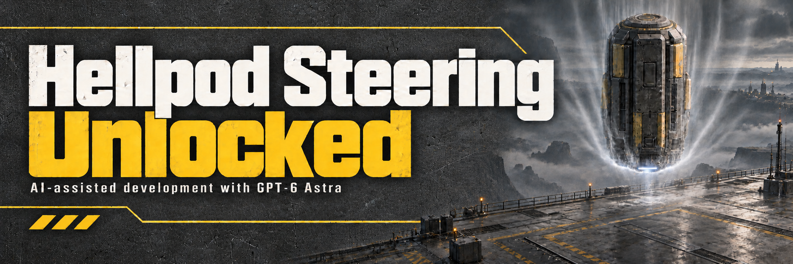

> Current local compatibility candidate for Steam build 25480438 / EXE 1.8.46015.0. Offline checks passed; live gameplay verification is pending.

# Hellpod Steering Unlocked

> [!IMPORTANT]
> **Bingus Shared Loader is now a separate required download.** [Download the latest loader](https://github.com/CowboyBingus/BingusSharedLoader/releases/latest), import `Bingus-Shared-Loader-v17.zip` into Arsenal or HD2MM, and enable it alongside Hellpod Steering Unlocked before deploying. **This mod will not activate without the loader.** Mod managers do not install it automatically.
>
> **Arsenal (default priority): place Bingus Shared Loader LAST, at the bottom of the load order**, then **Purge → Deploy**. If you enabled first-mod priority, place the loader first instead.

[Download data-v7](https://github.com/CowboyBingus/HellpodSteeringUnlocked/releases/tag/data-v7)

Steer your hellpod toward rooftops, rocks and high ground without the game's base avoidance system pushing it away.

**Install:** Close the game, import `Bingus-Shared-Loader-v17.zip` and `Hellpod-Steering-Unlocked-v7.3.zip` into **HDArsenal** or **HD2MM**, enable both, and deploy. The loader is a required separate download; managers do not install it automatically. Use one manager. See [upgrading and uninstalling](INSTALL.txt).

This release is **data-v7**, for Steam build **25480438** / EXE **1.8.46015.0**. It contains only this gameplay module. Bingus Shared Loader owns the startup code, so later loader updates require replacing just the loader package. Other gameplay mods are optional.

Remove older packages with bundled loaders before deploying this candidate. This package requires Bingus Shared Loader loader-v2 or newer / API 1. The loader was formerly named Shared Mod Loader; its manager GUID and API are unchanged. In-game validation of the packaging transition remains pending.

The mod relaxes the base avoidance system. It does not guarantee unrestricted steering or a usable landing spot everywhere; related hellpod placement checks also see the changed setting.

The new gameplay packages and Bingus Shared Loader own distinct resources and do not overlap with each other. The loader preserves Wwise callbacks and does not replace `boot`, allowing the tested HD2 HUD+ 0.1.3 boot script to coexist. Another Wwise replacement can still conflict. See [compatibility](docs/COMPATIBILITY.md).

## Source

- `src/`: runtime Lua modules.
- `tests/`: synthetic memory, callback and package checks.
- `scripts/`: dependency setup, build, packaging and optional Arsenal validation.
- `cmd/`: tools for extracting and inspecting game resources.
- `assets/`: README banner and Arsenal thumbnail.

[Build from source](CONTRIBUTING.md) · [Technical walkthrough](docs/TECHNICAL.md) · [Third-party dependencies](THIRD_PARTY.md)

**AI disclosure:** GPT-6 Astra was used for research, implementation, debugging, documentation and artwork.

[Release notes](docs/RELEASE_NOTES.md) · [Artwork](assets/ARTWORK.md)

Current version: **v7.3**, for game build **25480438**. See [changes](CHANGELOG.md) and [validation coverage](docs/MIGRATION_VALIDATION.md).
